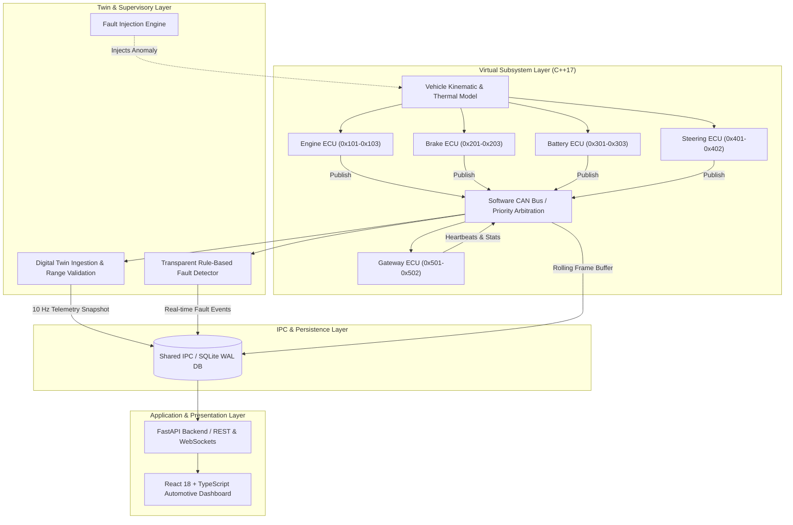

# VECU-Twin — Virtual ECU & Digital Twin Vehicle Simulator

[](https://isocpp.org/)
[](https://www.python.org/)
[](https://fastapi.tiangolo.com/)
[](https://react.dev/)
[](https://opensource.org/licenses/MIT)

> **A professional, software-only automotive digital twin and virtual Electronic Control Unit (ECU) simulation platform.**
> Designed as an end-to-end technical portfolio and interview demonstration for Embedded Software, Automotive Systems, and AI/ML Engineering.

---

## 1. Overview

Modern vehicle development relies heavily on **Software-in-the-Loop (SIL)** environments. Physical test mules, prototype hardware, and physical CAN buses are expensive, scarce, and become available only in late development stages. 

**VECU-Twin** simulates an entire automotive subsystem in software without requiring physical microcontrollers, Arduino, Raspberry Pi, CAN adapters, or OBD hardware:

> **Virtual ECUs** ➔ **CAN Bus Priority Arbitration** ➔ **Vehicle Physics** ➔ **Digital Twin** ➔ **Fault Injection & Detection** ➔ **Live Dashboard**

---

## 2. Architecture



---

## 3. Key Features

- **5 Independent Virtual ECUs**:
  - **Engine ECU**: Models RPM curves, temperature generation, throttle load, and operating states.
  - **Brake ECU**: Simulates hydraulic pressure build/bleed and vehicle deceleration kinematics.
  - **Battery ECU**: EV pack simulation covering State of Charge (SOC), voltage curves, and thermal exchange.
  - **Steering ECU**: Position control modeling angular displacement (±540°) with safe mechanical limit alarms.
  - **Gateway ECU**: Central network supervisor tracking node heartbeats, frame rates, and bus throughput.
- **Software CAN-Bus Abstraction**:
  - Thread-safe MPSC frame delivery.
  - **Arbitration Simulation**: Numerical priority sorting (lower CAN ID wins arbitration).
  - Explicit big-endian binary payload encoding/decoding.
- **Independent Digital Twin**:
  - Decoupled from simulator ground truth; reconstructs vehicle state purely from CAN telemetry.
  - Live data freshness and synchronization age tracking.
  - Automated physical range and checksum validation.
- **Deterministic Fault Injection & Detection**:
  - **Supported Faults**: Engine Overheat, RPM Runaway, Hydraulic Brake Failure, Rapid Battery Degradation, Sensor Stuck (frozen signal), ECU Communication Loss, Message Transmission Delay, and Cross-System State Inconsistencies.
  - **Multi-tier Severity**: `NORMAL`, `WARNING`, `CRITICAL`.
- **Full-Stack Tooling**:
  - High-performance C++17 core engine.
  - Async FastAPI backend with SQLite WAL storage and NumPy/Pandas analysis routines.
  - React 18 / TypeScript / Vite / Tailwind CSS / Recharts dark automotive dashboard.

---

## 4. Virtual ECU Catalog & CAN Matrix

| CAN ID | Name | Source ECU | Update Rate | Encoded Payload |
|---|---|---|---|---|
| `0x101` | `ENGINE_RPM` | `ENGINE_ECU` | 10 Hz (100ms) | RPM uint16, Load % uint8, State uint8 |
| `0x102` | `ENGINE_TEMP` | `ENGINE_ECU` | 5 Hz (200ms) | Engine temp (0.1 °C) int16 |
| `0x103` | `ENGINE_STATUS`| `ENGINE_ECU` | 2 Hz (500ms) | Operating state, fault bitmask |
| `0x201` | `BRAKE_STATUS` | `BRAKE_ECU` | 20 Hz (50ms) | Brake pedal active flag, failure flag |
| `0x202` | `BRAKE_PRESSURE`| `BRAKE_ECU`| 20 Hz (50ms) | Hydraulic pressure (0.1 bar) uint16 |
| `0x203` | `VEHICLE_SPEED` | `BRAKE_ECU` | 10 Hz (100ms)| Road speed (0.1 km/h) uint16 |
| `0x301` | `BATTERY_STATUS`| `BATTERY_ECU`| 5 Hz (200ms) | SOC % uint8, Charging flag uint8 |
| `0x302` | `BATTERY_TEMP` | `BATTERY_ECU` | 2 Hz (500ms) | Pack temp (0.1 °C) int16 |
| `0x303` | `BATTERY_VOLTAGE`| `BATTERY_ECU`| 2 Hz (500ms)| Pack voltage (0.1 V) uint16 |
| `0x401` | `STEERING_ANGLE`| `STEERING_ECU`| 20 Hz (50ms) | Angle (0.1 deg signed) int16 |
| `0x402` | `STEERING_STATUS`| `STEERING_ECU`| 5 Hz (200ms) | Direction enum, Limit flag |
| `0x501` | `GATEWAY_STATUS`| `GATEWAY_ECU` | 1 Hz (1000ms)| Node health bitmask |
| `0x502` | `GATEWAY_STATS` | `GATEWAY_ECU` | 1 Hz (1000ms)| Cumulative frame counter uint32 |

---

## 5. Project Structure

```
VECU-Twin/
├── CMakeLists.txt              # Top-level CMake build
├── requirements.txt            # Python dependencies
├── .env.example                # Configuration template
├── README.md                   # Project documentation
│
├── config/                     # System JSON configurations
│   ├── vehicle.json            # Physical limits & kinematics
│   ├── ecu_config.json         # ECU frequencies & CAN IDs
│   ├── can_messages.json       # CAN frame payload catalog
│   └── fault_config.json       # Thresholds & detection rules
│
├── cpp/                        # C++17 Core Simulator
│   ├── CMakeLists.txt          # Library & binary targets
│   ├── include/                # Header definitions
│   │   ├── CANFrame.hpp
│   │   ├── CANBus.hpp
│   │   ├── VirtualECU.hpp
│   │   ├── EngineECU.hpp
│   │   ├── BrakeECU.hpp
│   │   ├── BatteryECU.hpp
│   │   ├── SteeringECU.hpp
│   │   ├── GatewayECU.hpp
│   │   ├── VehicleModel.hpp
│   │   ├── DigitalTwin.hpp
│   │   ├── FaultEngine.hpp
│   │   ├── FaultDetector.hpp
│   │   ├── Logger.hpp
│   │   └── ThreadSafeQueue.hpp
│   ├── src/                    # C++ Implementations
│   │   └── main.cpp            # Concurrency scheduler & IPC writer
│   └── tests/                  # GoogleTest unit test suite
│
├── python/                     # Backend, API & Analytics
│   ├── api/                    # FastAPI routes & Pydantic schemas
│   ├── storage/                # SQLite WAL database layer
│   ├── simulation/             # Standalone Python simulator engine
│   ├── analysis/               # NumPy/Pandas vehicle & fault analytics
│   └── tests/                  # Pytest verification suite
│
├── frontend/                   # React 18 + TypeScript Dashboard
│   ├── src/                    # Components, hooks, & services
│   ├── package.json
│   └── vite.config.ts
│
├── docs/                       # Technical Documentation
│   ├── architecture.md
│   ├── virtual_ecu.md
│   ├── digital_twin.md
│   ├── can_communication.md
│   ├── vehicle_model.md
│   ├── fault_injection.md
│   ├── testing.md
│   └── interview_guide.md
│
├── examples/                   # Scenario definition files
└── scripts/                    # Build, test, & execution scripts
```

---

## 6. Quick Start & Execution

### Prerequisites
- **Python**: 3.11+
- **Node.js**: 18+ & npm
- **C++ Compiler** *(Optional if running in Standalone Mode)*: GCC 9+, Clang 10+, or MSVC 2019+ & CMake 3.16+

### 1. Setup Python Environment
```bash
python -m venv .venv

# Windows:
.venv\Scripts\activate
# Linux/macOS:
source .venv/bin/activate

pip install -r requirements.txt
```

### 2. Run Backend (Standalone Mode / Instant Demo)
```bash
# Powershell:
.\scripts\run_backend.ps1

# Bash:
./scripts/run_backend.sh
```
> API will start at `http://localhost:8000`. Swagger documentation available at `http://localhost:8000/docs`.

### 3. Run Frontend Dashboard
```bash
# Powershell:
.\scripts\run_frontend.ps1

# Bash:
./scripts/run_frontend.sh
```
> Dashboard will open at `http://localhost:5173`.

### 4. Optional: Build and Run C++ High-Performance Simulator
```bash
# Build C++ simulator & GoogleTests:
cmake -S . -B build
cmake --build build --config Release

# Run simulator binary:
./build/cpp/vecu_sim ./data
```

---

## 7. Running Automated Test Suites

```bash
# 1. Run Python API & Storage Tests (52 passed)
pytest python/tests/ -v

# 2. Run C++ Concurrency & Kinematics Tests
cd build && ctest --output-on-failure

# 3. Build & Typecheck Frontend
cd frontend && npm run build
```

---

## 8. Technical Documentation & Guides

Comprehensive technical guides are available in the [`docs/`](docs/) directory:

| Document | Description |
|---|---|
| 📖 [Architecture Specification](docs/architecture.md) | High-level system architecture, threading models, and IPC design. |
| ⚡ [Virtual ECU Guide](docs/virtual_ecu.md) | State machines, update loops, and telemetry calculation for all 5 ECUs. |
| 🌐 [CAN Communication](docs/can_communication.md) | Software CAN arbitration, MPSC queues, message encoding, and DBC layout. |
| 🚗 [Vehicle Kinematics](docs/vehicle_model.md) | Powertrain physics, acceleration/braking formulas, and thermal balance. |
| 🪞 [Digital Twin](docs/digital_twin.md) | Shadow state synchronization, validity checking, and freshness tracking. |
| ⚠️ [Fault Injection](docs/fault_injection.md) | Deterministic fault triggers, DTC catalogs, and detection threshold rules. |
| 🧪 [Testing Guide](docs/testing.md) | Unit test strategy, integration coverage, and CI verification procedures. |
| 💼 [Interview Defense Guide](docs/interview_guide.md) | 25+ technical interview Q&As covering design choices, SIL/HIL, and embedded systems. |

---

## 9. Simulation Scenario Catalog

Preset test scenarios located in [`examples/`](examples/):

* **`NORMAL_DRIVE`**: Standard cruising condition (~60 km/h, 2,000 RPM, balanced battery discharge).
* **`ACCELERATION`**: Full throttle profile (0 to 120 km/h, engine RPM ramping to 4,500).
* **`BRAKING`**: Emergency brake application (speed deceleration at 15 km/h/s, 45 bar hydraulic pressure).
* **`ENGINE_OVERHEAT`**: Thermal runaway injection (engine temp exceeding 110°C warning and 130°C critical threshold).
* **`BRAKE_FAILURE`**: Hydraulic line loss simulation (pedal depressed but line pressure fails to build).
* **`BATTERY_FAULT`**: Rapid cell degradation simulation (voltage droop and high discharge rate).
* **`COMMUNICATION_LOSS`**: Node silence condition (CAN frame timeout detection by Central Gateway).

---

## 10. Limitations & Scope

- **Software-Only Abstraction**: Simulates message-level CAN frame priority and payload handling; does not simulate physical transceiver voltage levels (dominant/recessive bit timing).
- **Vehicle Model**: Focused on powertrain, braking, battery, and steering dynamics. Aerodynamics and multi-body tire traction models are intentionally simplified to maintain determinism.

---

## 11. Future Roadmap

- [ ] Linux **SocketCAN** (`vcan0`) driver integration.
- [ ] AUTOSAR Classic RTE C++ interface binding.
- [ ] Hardware-in-the-Loop (HIL) testing harness with dSPACE/Vector hardware.
- [ ] OpenSCENARIO XML format parser.

---

## 12. License

Distributed under the MIT License. See [LICENSE](LICENSE) for more details.
