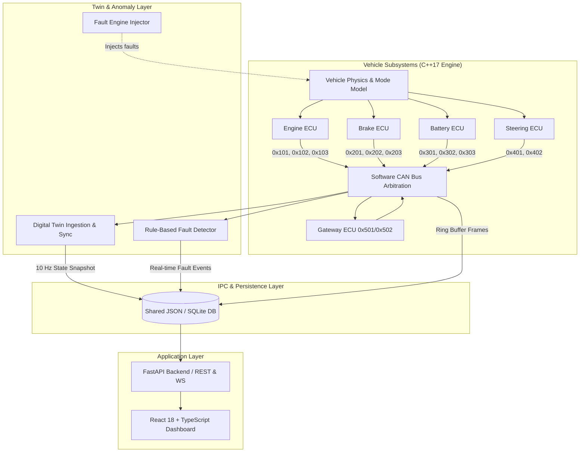

# VECU-Twin Architecture & Technical Overview

## 1. Executive Summary

**VECU-Twin** is a software-in-the-loop (SIL) automotive simulator designed to demonstrate modern software-defined vehicle (SDV) concepts without physical hardware.

The architecture strictly decouples the ground-truth physical simulation (Virtual ECUs) from the telemetry ingestion layer (Digital Twin) and supervisory analytics (Fault Engine & Monitoring API).

## 2. Core Modules

| Module | Language / Tech | Primary Responsibility |
|---|---|---|
| **Virtual ECUs** | C++17 (`std::thread`) | Autonomous periodic message generators modeling physical node behavior. |
| **Software CAN Bus** | C++17 (`std::mutex`, `std::condition_variable`) | In-process priority queue with min-CAN-ID arbitration simulation. |
| **Digital Twin** | C++17 / Python | Reconstructs vehicle telemetry purely from CAN frames, tracking sync age and health. |
| **Fault Engine & Detector** | C++17 / Python | Deterministic fault injection with rule-based multi-tier severity alerting. |
| **REST & WebSocket API** | Python 3.11 (FastAPI, Pydantic) | Exposes telemetry, history, statistics, and simulation control endpoints. |
| **Dashboard** | React 18, Vite, Tailwind CSS, Recharts | Low-latency engineering monitor with real-time waveform plotting. |

## 3. Concurrency Model

- Each Virtual ECU runs in a dedicated `std::thread` synchronized via high-resolution sleep timers (`std::chrono`).
- CAN Bus message queue implements the **Multiple-Producer Single-Consumer (MPSC)** pattern using `std::unique_lock` and condition variables.
- Clean shutdown is guaranteed via atomic booleans (`std::atomic<bool>`) across all worker threads.
