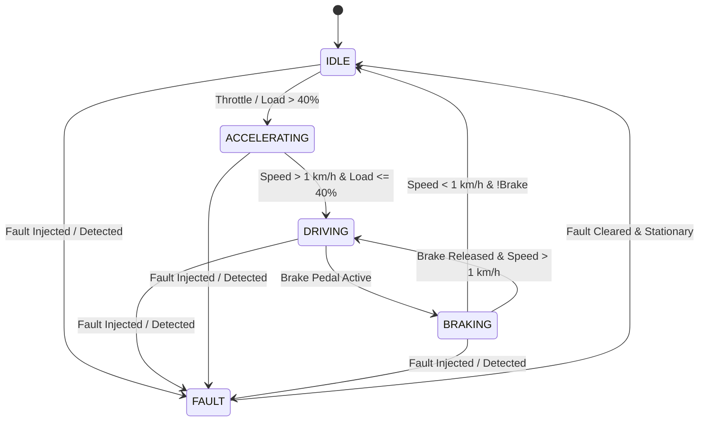

# Vehicle Physics Model & State Machine

## 1. Physical Parameter State

The vehicle state aggregates multi-physics domains into a single thread-safe container:

```cpp
struct VehicleState {
    double speed_kmh;
    double rpm;
    double engine_temperature_c;
    double engine_load_pct;
    bool   brake_active;
    double brake_pressure_bar;
    double battery_pct;
    double battery_voltage_v;
    double battery_temperature_c;
    bool   battery_charging;
    double steering_angle_deg;
    VehicleMode mode;
    double timestamp;
};
```

## 2. Finite State Machine (FSM)

The operational mode of the vehicle is dynamically inferred through physical observability rules:



## 3. Kinematic & Thermal Relationships

1. **RPM Calculation**:
   $$\text{Target RPM} = \text{RPM}_{\text{idle}} + \left(\frac{\text{Load}}{100}\right) \times (\text{RPM}_{\text{max}} - \text{RPM}_{\text{idle}})$$
2. **Thermal Dissipation**:
   $$\frac{dT}{dt} = k_{\text{heat}} \cdot \text{Load} - k_{\text{cool}} \cdot (T - T_{\text{ambient}})$$
3. **Hydraulic Deceleration**:
   $$a_{\text{decel}} = a_{\text{max}} \cdot \left(\frac{P_{\text{brake}}}{P_{\text{max}}}\right)$$
